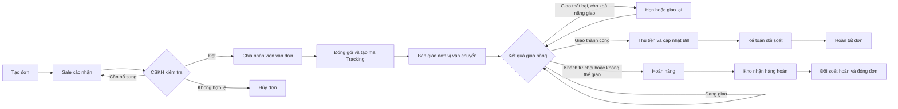

# Lộ trình đi của đơn hàng

## 1. Mục đích

Tài liệu mô tả hành trình của một đơn hàng từ lúc được tạo trên hệ thống đến khi giao thành công, hoàn hàng hoặc hủy. Đây là tài liệu tham chiếu chung cho Marketing, Sale, CSKH, Vận đơn, Kho và Kế toán.

## 2. Sơ đồ tổng quan

## 3. Chi tiết từng giai đoạn

| Bước | Giai đoạn | Bộ phận chính | Công việc cần thực hiện | Dữ liệu cần cập nhật | Kết quả chuyển bước |
|---:|---|---|---|---|---|
| 1 | Tạo đơn | Marketing/Sale | Nhập thông tin khách hàng, sản phẩm, số lượng, giá bán và nguồn đơn | `order_code`, `order_date`, thông tin khách hàng, sản phẩm, `marketing_staff`, `sale_staff`, `team` | Đơn được ghi nhận trên hệ thống |
| 2 | Xác nhận đơn | Sale | Gọi xác nhận nhu cầu, địa chỉ, sản phẩm, giá và phương thức thanh toán | Ghi chú Sale, địa chỉ, số điện thoại, `payment_method`, `sale_price` | Đơn hợp lệ được chuyển CSKH |
| 3 | Kiểm tra đơn | CSKH | Kiểm tra lại thông tin, lịch sử khách hàng, blacklist và nội dung cần lưu ý | `check_result`, `cskh_status`, `customer_type`, `blacklist_status`, ghi chú CSKH | Đạt để chia vận đơn, trả Sale bổ sung hoặc hủy |
| 4 | Chia vận đơn | Điều phối/Vận đơn | Gán đơn cho nhân viên vận đơn đang hoạt động theo chi nhánh hoặc đội nhóm | `delivery_staff`, ngày chia vận đơn, ca làm việc | Đơn có người phụ trách xử lý |
| 5 | Đóng hàng | Kho/Vận đơn | Soạn hàng, kiểm tra số lượng, đóng gói và xác nhận ngày đóng | `ngaydonghang`, sản phẩm thực xuất, số lượng, quà tặng | Kiện hàng sẵn sàng bàn giao |
| 6 | Tạo vận đơn | Vận đơn | Chọn đơn vị vận chuyển và tạo mã theo dõi | `tracking_code`, `shipping_unit` hoặc `carrier`, phí vận chuyển, ngày dự kiến giao | Có mã Tracking để theo dõi |
| 7 | Bàn giao vận chuyển | Kho/Vận đơn | Bàn giao kiện hàng cho đơn vị vận chuyển và theo dõi lần quét đầu tiên | `delivery_status_nb`, `tracking_check_date`, ghi chú vận đơn | Đơn bắt đầu hành trình giao |
| 8 | Theo dõi giao hàng | Vận đơn/CSKH | Theo dõi trạng thái, liên hệ khách khi giao chậm hoặc thất bại | `delivery_status`, `delivery_status_nb`, `postponed_date`, lý do và ghi chú | Giao thành công, giao lại, hoàn hoặc hủy |
| 9 | Thu tiền/Bill | Vận đơn/Kế toán | Ghi nhận số tiền đã thu và chứng từ thanh toán | `payment_status`, `payment_status_detail`, `payment_bill`, `payment_image`, `ngayupbill` | Đủ dữ liệu để đối soát |
| 10 | Đối soát | Kế toán | Đối chiếu tiền thu, phí vận chuyển, phí kho và các khoản chênh lệch | `reconciled_vnd`, `reconciled_amount`, `accountant_confirm`, `accounting_check_date` | Hoàn tất tài chính của đơn |
| 11 | Đóng đơn | Kế toán/Điều hành | Xác nhận kết quả cuối cùng và lưu vết thay đổi | Trạng thái giao hàng, trạng thái thanh toán, người cập nhật cuối | Đơn hoàn tất hoặc đóng theo nhánh ngoại lệ |

## 4. Trạng thái giao hàng

Các trạng thái trong dữ liệu có thể khác nhau về chữ hoa, chữ thường hoặc cách viết. Khi tổng hợp báo cáo cần chuẩn hóa về các nhóm sau:

| Nhóm trạng thái | Ý nghĩa | Hành động tiếp theo |
|---|---|---|
| `Trống trạng thái` | Chưa có kết quả từ đơn vị vận chuyển | Kiểm tra mã Tracking và lần quét đầu tiên |
| `Chờ check` | Đơn đang chờ kiểm tra hoặc đồng bộ | Vận đơn kiểm tra lại với nhà vận chuyển |
| `Chưa Giao` | Chưa bắt đầu giao cho khách | Theo dõi lịch phát hàng |
| `Đang Giao` | Nhân viên giao hàng đang phát đơn | Theo dõi đến khi có kết quả |
| `Giao Thành Công` | Khách đã nhận hàng | Cập nhật thu tiền/Bill và chuyển đối soát |
| `Hoàn` | Đơn đang hoàn hoặc đã hoàn về kho | Xác nhận hàng hoàn và chi phí liên quan |
| `Hủy` | Đơn không tiếp tục xử lý | Ghi rõ lý do và đóng đơn |

> Không chuyển một đơn sang trạng thái hoàn tất chỉ dựa trên việc có mã Tracking. Kết quả giao hàng và kết quả đối soát phải được xác nhận độc lập.

## 5. Trạng thái thanh toán

| Nhóm trạng thái | Ý nghĩa | Điều kiện đóng tài chính |
|---|---|---|
| Chưa thu/Trống | Chưa ghi nhận tiền từ đơn | Tiếp tục theo dõi nếu đơn đã giao thành công |
| `Có bill 1 phần` | Mới ghi nhận một phần số tiền cần thu | Đối chiếu phần còn thiếu |
| `Có bill` | Đã có chứng từ ghi nhận tiền | Kế toán kiểm tra số tiền và chứng từ |
| Đã đối soát | Tiền và các khoản phí đã được xác nhận | Có thể đóng tài chính của đơn |

Một mã Tracking có thể gắn với nhiều đơn. Khi nhập Bill, hệ thống có thể gom tiền theo `tracking_code` và phân bổ cho các đơn liên quan; trường hợp không có mã Tracking hoặc đơn `Drop off` cần đối chiếu bằng `order_code`.

## 6. Các nhánh ngoại lệ

### 6.1. Thiếu hoặc sai thông tin

1. CSKH hoặc Vận đơn trả đơn về Sale.
2. Ghi rõ nội dung cần bổ sung trong ghi chú.
3. Sale cập nhật thông tin và gửi kiểm tra lại.
4. Không tạo mã Tracking khi địa chỉ, số điện thoại hoặc sản phẩm chưa được xác nhận.

### 6.2. Giao thất bại nhưng còn khả năng giao lại

1. Ghi nhận lý do giao thất bại.
2. CSKH liên hệ lại với khách.
3. Cập nhật `postponed_date` nếu khách hẹn ngày khác.
4. Theo dõi lần giao tiếp theo, không chuyển sang `Hoàn` quá sớm.

### 6.3. Hoàn hàng

1. Xác nhận trạng thái hoàn từ đơn vị vận chuyển.
2. Theo dõi kiện hàng về kho.
3. Kho kiểm tra sản phẩm, số lượng và tình trạng hàng.
4. Kế toán đối soát phí giao, phí hoàn và tiền đã thu nếu có.
5. Đóng đơn với lý do hoàn rõ ràng.

### 6.4. Hủy đơn

Đơn có thể bị hủy trước khi giao do khách không xác nhận, thông tin không hợp lệ, hết hàng hoặc lý do nghiệp vụ khác. Người xử lý phải cập nhật lý do hủy; nếu đã tạo mã Tracking thì cần đồng thời hủy vận đơn với nhà vận chuyển.

## 7. Điểm kiểm soát bắt buộc

- Mỗi đơn phải có `order_code` duy nhất.
- Trước khi đóng hàng phải xác nhận đúng khách hàng, sản phẩm, số lượng và địa chỉ.
- Đơn gửi qua nhà vận chuyển phải có `tracking_code`; đơn tự giao có thể dùng quy ước `Drop off`.
- Mọi thay đổi quan trọng về mã Tracking, trạng thái giao hàng và trạng thái thanh toán phải có người cập nhật và thời điểm cập nhật.
- Đơn `Giao Thành Công` nhưng chưa có Bill phải nằm trong danh sách cần thu tiền.
- Đơn có Bill nhưng chưa đối soát không được xem là hoàn tất tài chính.
- Đơn hoàn hoặc hủy phải có lý do và ghi chú xử lý cuối cùng.
- Không xóa lịch sử trạng thái; chỉ bổ sung bản ghi mới hoặc lưu vết thay đổi.

## 8. Tiêu chí hoàn tất đơn hàng

Một đơn chỉ được coi là **hoàn tất** khi đáp ứng đầy đủ:

1. Kết quả giao hàng cuối cùng đã rõ ràng.
2. Trạng thái thanh toán phù hợp với kết quả giao hàng.
3. Kế toán đã đối soát tiền và các khoản phí liên quan.
4. Không còn cảnh báo thiếu thông tin, thiếu Bill hoặc chênh lệch tiền.
5. Có đủ người xử lý, thời điểm cập nhật và ghi chú cho các trường hợp ngoại lệ.

Với đơn `Hoàn` hoặc `Hủy`, “hoàn tất” có nghĩa là đơn đã được đóng về mặt vận hành và tài chính, không có nghĩa là giao thành công.

